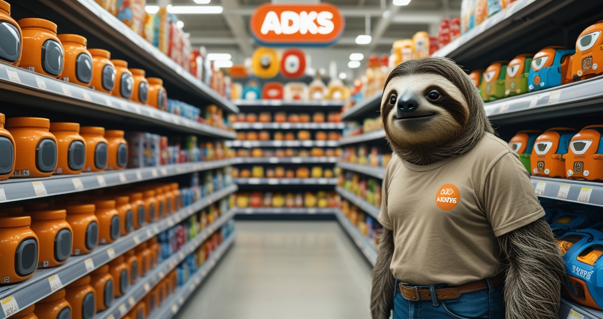

# Agent Development Kits (ADKs) Index

Point in time collection of Agent Development Kits for building AI agents and related tooling.

## Inclusion Criteria
- **ADKs only**: Focused on actual development kits and frameworks for agent development

## Exclusion Criteria
- **No demos, notebooks, or examples**: There are countless demos, notebooks, and prototypes available online, but due to their volume, these are kept separate from this focused collection of development kits.

---

## Google ADKs (And Components)

| Name | Stars | Repository | Description |
|------|-------|------------|-------------|
| **Google ADK Java** |  |  | Google's official Java ADK |
| **Google ADK Python** |  |  | Google's official Python ADK |
| **Google ADK Samples** |  |  | Official samples and documentation |
| **Google ADK Web** |  |  | Google's web-based ADK |

## Other ADKs

| Name | Stars | Repository | Description |
|------|-------|------------|-------------|
| **ADK TypeScript** |  |  | TypeScript port of Google ADK |
| **AIDC Agentic ADK** |  |  | AI-focused agentic development kit |
| **Arcade AI** |  |  | Arcade AI development framework |
| **Axway Agent SDK** |  |  | Axway's agent development SDK |
| **Cognisphere** |  |  | Cognitive agent development sphere |
| **IBM Watson Orchestrate ADK** |  |  | IBM's Watson orchestration ADK |
| **Inference Gateway ADK** |  |  | Inference gateway development kit |
| **Nerve** |  |  | The Simple ADK |
| **Neuron AI** |  |  | PHP-based AI agent framework |
| **Volcengine ADK** |  |  | Volcengine Python ADK |

---

## Organization by Provider

### Google ADKs
- **Python**: [google/adk-python](https://github.com/google/adk-python)
- **Java**: [google/adk-java](https://github.com/google/adk-java)  
- **Web**: [google/adk-web](https://github.com/google/adk-web)
- **Samples**: [google/adk-samples](https://github.com/google/adk-samples)

### Enterprise Solutions
- **IBM Watson**: [IBM/ibm-watsonx-orchestrate-adk](https://github.com/IBM/ibm-watsonx-orchestrate-adk)
- **Axway**: [Axway/agent-sdk](https://github.com/Axway/agent-sdk)
- **Volcengine**: [volcengine/veadk-python](https://github.com/volcengine/veadk-python)

### Community & Independent
- **AIDC AI**: [AIDC-AI/Agentic-ADK](https://github.com/AIDC-AI/Agentic-ADK)
- **Arcade AI**: [ArcadeAI/arcade-ai](https://github.com/ArcadeAI/arcade-ai)
- **Nerve**: [evilsocket/nerve](https://github.com/evilsocket/nerve)
- **Others**: Various community-driven projects

---

*Last updated: August 2025*
